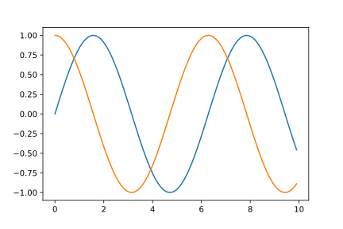
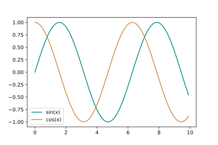
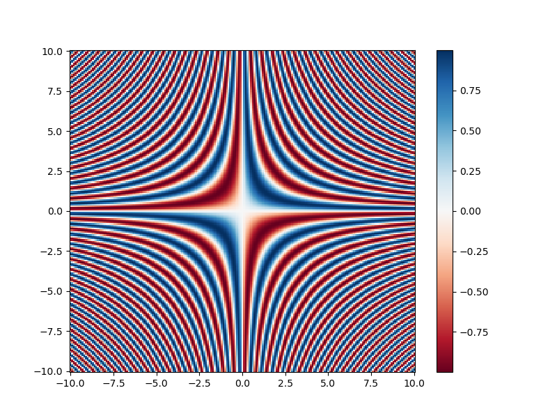

## [`matplotlib`](https://matplotlib.org/) is the most widely used scientific plotting library in Python.

*   Commonly use a sub-library called [`matplotlib.pyplot`](https://matplotlib.org/stable/api/_as_gen/matplotlib.pyplot.html#module-matplotlib.pyplot).
*   The Jupyter Notebook will render plots inline by default.

~~~
import matplotlib.pyplot as plt
~~~
{: .language-python}

*   Simple plots are then (fairly) simple to create.

~~~
time = [0, 1, 2, 3]
position = [0, 100, 200, 300]

plt.plot(time, position)
plt.xlabel('Time (hr)')
plt.ylabel('Position (km)')
~~~
{: .language-python}

> ## Display All Open Figures
>
> In our Jupyter Notebook example, running the cell should generate the figure directly below the code.
> The figure is also included in the Notebook document for future viewing.
> However, other Python environments like an interactive Python session started from a terminal
> or a Python script executed via the command line require an additional command to display the figure.
>
> Instruct `matplotlib` to show a figure:
> ~~~
> plt.show()
> ~~~
> {: .language-python}
>
> This command can also be used within a Notebook - for instance, to display multiple figures
> if several are created by a single cell.
>
{: .callout}

## Plotting data from NumPy arrays

Let's generate some data using NumPy:

~~~
x = np.arange(0, 10, 0.1)
sin_x = np.sin(x)
cos_x = np.cos(x)
~~~
{: .language-python}

The `np.arange` function will generate an array of number starting at `0` and stopping _before_ `10`, with an interval of `0.1`.

We can plot the value of `sin(x)` and `cos(x)` on the same axes:

~~~
plt.plot(x, sin_x)
plt.plot(x, cos_x)
~~~
{: .language-python}

We can set the [colour](https://matplotlib.org/stable/_images/sphx_glr_named_colors_003.png) of the lines using the `c` option to `plot()`, and we can add a legend to indicate which values belong to which series:

~~~
plt.plot(x, sin_x, c='teal', label='sin(x)')
plt.plot(x, cos_x, c='peru', label='cos(x)')
plt.legend(loc='lower left')
~~~
{: .language-python}

> ## Adding a Legend
>
> Often when plotting multiple datasets on the same figure it is desirable to have
> a legend describing the data.
>
> This can be done in `matplotlib` in two stages:
>
> * Provide a label for each dataset in the figure:
>
> ~~~
> plt.plot(x, sin_x, label='sin(x)')
> plt.plot(x, cos_x, label='cos(x)')
> ~~~
> {: .language-python}
>
> * Instruct `matplotlib` to create the legend.
>
> ~~~
> plt.legend()
> ~~~
> {: .language-python}
>
> By default matplotlib will attempt to place the legend in a suitable position. If you
> would rather specify a position this can be done with the `loc=` argument, e.g to place
> the legend in the upper left corner of the plot, specify `loc='upper left'`
>
{: .callout}

Matplotlib is capable of making many type of plots. We can create a scatter plot of the `sin(x)` values:

~~~
plt.figure(figsize=(10, 8))
plt.scatter(x, sin_x, c=x, s=x*3)
plt.xlabel('x', fontsize=16)
plt.ylabel('sin(x)', fontsize=16)
plt.title('sine plot', fontsize=18)
plt.tick_params(labelsize=14)
plt.colorbar()
plt.savefig('sin.png')
~~~
{: .language-python}

Each plotting function in Matplotlib has its own set of argmuents. The documentation for the `scatter()` function can be found [here](https://matplotlib.org/stable/api/_as_gen/matplotlib.pyplot.scatter.html).

The `plt.figure(figsize=(10, 8))` command is used to create a figure of the specified size. The default units for Matplotlib figures are inches. In this instance the figure size is adjusted, to avoid any axes labels being cut off when saving the plot to a file, to 10 inches wide by 8 inches high.

The `c=x` option sets the colour value of the scatter points based on the value of `x`. The `s=x*3` options sets the size of the scatter points based on the values of `x` multiplied by 3.

A title is added to the plot using `plt.title()`. The font size is set using the `fontsize` argument for the title, x axis label and y axis label. To set the font size for the tick labels, the `plt._tick_params()` function is used, where the size is set using the `labelsize` option.

A colour scale is added using the function `plt.colorbar()`.

> ## Saving your plot to a file
>
> If you are satisfied with the plot you see you may want to save it to a file,
> perhaps to include it in a publication. There is a function in the
> matplotlib.pyplot module that accomplishes this:
> [savefig](https://matplotlib.org/api/_as_gen/matplotlib.pyplot.savefig.html).
> Calling this function, e.g. with
> ~~~
> plt.savefig('my_figure.png')
> ~~~
> {: .language-python}
>
> will save the current figure to the file `my_figure.png`. The file format
> will automatically be deduced from the file name extension (other formats
> are pdf, ps, eps and svg).
>
> Note that functions in `plt` refer to a global figure variable
> and after a figure has been displayed to the screen (e.g. with `plt.show`)
> matplotlib will make this  variable refer to a new empty figure.
> Therefore, make sure you call `plt.savefig` before the plot is displayed to
> the screen, otherwise you may find a file with an empty plot.
{: .callout}

## Creating a figure containing multiple plots

In the above examples, Matplotlib is automatically creating the figure and axes
for each plot, but there are various ways in which these elements can be
manually created where required.

For example, the `plt.subplots()` function can be used to create a figure
which contains multiple sets of axes.

If we wished to create a figure containing two plots, we could use the command:

~~~
fig, ax = plt.subplots(nrows=2, ncols=1)
~~~
{: .language-python}

This function returns two values, the figure, which we have stored as `fig`
and the axes, which we have stored as `ax`.

If we `print()` the `ax` variable, which should see that this is a list
containing the axes we have requested:

~~~
fig, ax = plt.subplots(nrows=2, ncols=1)
print(ax)
~~~
{: .language-python}
~~~
[<Axes: > <Axes: >]
~~~
{: .output}

We can access each set of axes from the `ax` variable, and create a plot
within.

When plotting this way, we access the plotting functions (e.g. `plot()`,
`scatter()`) as a method of the axes.

We could create a figure containing subplots of `sin(x)` and `cos(x)` using
the following method:

~~~
# create the figure and axes:
fig, ax = plt.subplots(nrows=2, ncols=1)

# access the first set of axes:
ax0 = ax[0]
# plot sin(x) in the first axes:
ax0.plot(x, sin_x)
# set the plot title:
ax0.set_title('sin(x)')

# access the second set of axes:
ax1 = ax[1]
# plot cos(x) in the second axes:
ax1.plot(x, cos_x)
# set the plot title:
ax1.set_title('cos(x)')

# set the figure title:
fig.suptitle('plots of sin(x) and y(x)')
# save the figure:
fig.savefig('sin_and_cos_plots.png')
~~~
{: .language-python}

## Plotting 2d data

Matplotlib has various options available for plotting 2d data, such as:

* [`pcolormesh`](https://matplotlib.org/stable/api/_as_gen/matplotlib.pyplot.pcolormesh.html), pseudocolor plot with a non-regular rectangular grid.
* [`contour`](https://matplotlib.org/stable/api/_as_gen/matplotlib.pyplot.contour.html), contour lines.
* [`contourf`](https://matplotlib.org/stable/api/_as_gen/matplotlib.pyplot.contourf.html), filled contours.

To test some of these, we will first use NumPy to generate some 2d data.

~~~
# create the x and y values, from -10 to 10, with a 0.1 increment, using the
# numpy arange function:
x = np.arange(-10, 10.1, 0.1)
y = np.arange(-10, 10.1, 0.1)

# create x and y coordinate grids using the numpy meshgrid function:
grid_x, grid_y = np.meshgrid(x, y)
~~~
{: .language-python}

Here, we use the NumPy [`meshgrid`](https://numpy.org/doc/stable/reference/generated/numpy.meshgrid.html) function, which is a versatile NumPy function used to create coordinate grids from one-dimensional coordinate arrays. It is widely used in mathematical computations, plotting, and simulations, where grid-like data is essential.

This example provides a demonstration of how the `meshgrid` function works, and the output which it creates:

~~~
x_coords, y_coords = np.meshgrid([1, 2, 3], [6, 7, 8, 9])

print(x_coords)
print(y_coords)
~~~
{: .language-python}
~~~
[[1 2 3]
 [1 2 3]
 [1 2 3]
 [1 2 3]]

[[6 6 6]
 [7 7 7]
 [8 8 8]
 [9 9 9]]
~~~
{: .output}

We can again use the NumPy `sin` function to generate our 2d data:

~~~
# generate 2d values for plotting using the numpy sin function:
z = np.sin(grid_x * grid_y)
~~~
{: .language-python}

Once we have some 2d data, a quick way to take a look at the data is using Matplotlib's [`imshow`](https://matplotlib.org/stable/api/_as_gen/matplotlib.pyplot.imshow.html) function:

~~~
plt.imshow(z)
~~~
{: .language-python}

The `imshow` function allows us to take a quick look at the data, but does not include the values for the x or y axes.

If we use Matplotlib's `contourf` function, we can include the x and y values in our plot:

~~~
# Create filled contour plot using Matplob's contourf function:
plt.contourf(x, y, z, cmap='RdBu')
# Add a colour bar:
plt.colorbar()
~~~
{: .language-python}

> ## Making your plots accessible
>
> Whenever you are generating plots to go into a paper or a presentation, there are a few things you can do to make sure that everyone can understand your plots.
> * Always make sure your text is large enough to read. Use the `fontsize` parameter in `xlabel`, `ylabel`, `title`, and `legend`, and [`tick_params` with `labelsize`](https://matplotlib.org/2.1.1/api/_as_gen/matplotlib.pyplot.tick_params.html) to increase the text size of the numbers on your axes.
> * Similarly, you should make your graph elements easy to see. Use `s` to increase the size of your scatterplot markers and `linewidth` to increase the sizes of your plot lines.
> * Using color (and nothing else) to distinguish between different plot elements will make your plots unreadable to anyone who is colorblind, or who happens to have a black-and-white office printer. For lines, the `linestyle` parameter lets you use different types of lines. For scatterplots, `marker` lets you change the shape of your points. If you're unsure about your colors, you can use [Coblis](https://www.color-blindness.com/coblis-color-blindness-simulator/) or [Color Oracle](https://colororacle.org/) to simulate what your plots would look like to those with colorblindness.
{: .callout}

> ## Colour scales
>
> Try and recreate the scatter plot for `cos(x)`, and see if you can change the colour scale to 'jet'.
>
> More information about Matplotlib colour maps can be found [here](https://matplotlib.org/stable/tutorials/colors/colormaps.html).
> {: .language-python}
> > ## Solution
> > ~~~
> > plt.figure(figsize=(10, 8))
> > plt.scatter(x, cos_x, c=x, s=x*3, cmap='jet')
> > plt.xlabel('x', fontsize=16)
> > plt.ylabel('sin(x)', fontsize=16)
> > plt.title('Cosine plot', fontsize=18)
> > plt.tick_params(labelsize=14)
> > plt.colorbar()
> > plt.savefig('cos.png')
> > ~~~
> > {: .language-python}
> > 
> {: .solution}
{: .challenge}

> ## More colour scales
>
> See if you can create a plot of the 2d `z` data, using the [`pcolormesh`](https://matplotlib.org/stable/api/_as_gen/matplotlib.pyplot.pcolormesh.html) function.
>
> Select a suitable [diverging](https://matplotlib.org/stable/users/explain/colors/colormaps.html#diverging) colour map for the plot .
> > ## Solution
> > ~~~
> > plt.figure(figsize=(10, 8))
> > plt.pcolormesh(x, y, z, cmap='RdBu')
> > plt.colorbar()
> > plt.savefig('2d_sin.png')
> > ~~~
> > {: .language-python}
> > 
> {: .solution}
{: .challenge}

