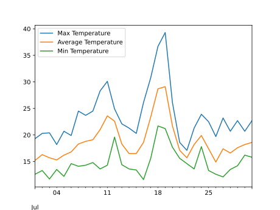
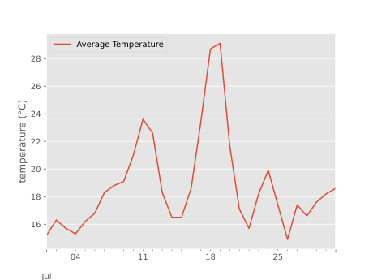
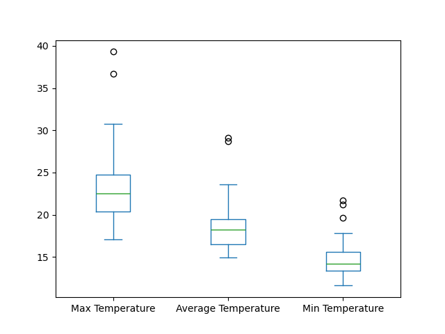

## Use the Pandas library to do statistics on tabular data.

*   Pandas is a widely-used Python library for statistics, particularly on tabular data.
*   Borrows many features from R's dataframes.
    *   A 2-dimensional table whose columns have names
        and potentially have different data types.
*   Load it with `import pandas as pd`. The alias pd is commonly used for Pandas.
*   Read a Comma Separated Values (CSV) data file with `pd.read_csv`.
    *   Argument is the name of the file to be read.
    *   Assign result to a variable to store the data that was read.

We are going to read some temperature data, collected by the
[NCAS weather station](https://www.wunderground.com/dashboard/pws/ILEEDS34)
in Leeds.

~~~
import pandas as pd

data = pd.read_csv('data/temperature_2022-07.csv')
print(data)
~~~
{: .language-python}
~~~
         Date  Max Temperature  Average Temperature  Min Temperature
0   2022-07-01             19.3                 15.2             12.6
1   2022-07-02             20.3                 16.3             13.3
2   2022-07-03             20.4                 15.7             11.7
...
28  2022-07-29             22.7                 17.6             14.2
29  2022-07-30             20.7                 18.2             16.2
30  2022-07-31             22.7                 18.6             15.8
~~~
{: .output}

*   The columns in a DataFrame are the observed variables, and the rows are the observations.
*   Pandas uses backslash `\` to show wrapped lines when output is too wide to fit the screen.

> ## File Not Found
>
> Our lessons store their data files in a `data` sub-directory,
> which is why the path to the file is `data/temperature_2022-07.csv`.
> If you forget to include `data/`,
> or if you include it but your copy of the file is somewhere else,
> you will get a [runtime error]({{ page.root }}/04-built-in/#runtime-error)
> that ends with a line like this:
>
> ~~~
> FileNotFoundError: [Errno 2] No such file or directory: 'data/temperature_2022-07.csv`
> ~~~
> {: .error}
{: .callout}

## Use `index_col` to specify that a column's values should be used as row headings.

*   Row headings are numbers (0 and 1 in this case).
*   Really want to index by date.
*   Pass the name of the column to `read_csv` as its `index_col` parameter to do this.

~~~
data = pd.read_csv('data/temperature_2022-07.csv', index_col='Date')
print(data)
~~~
{: .language-python}
~~~
            Max Temperature  Average Temperature  Min Temperature
Date                                                             
2022-07-01             19.3                 15.2             12.6
2022-07-02             20.3                 16.3             13.3
2022-07-03             20.4                 15.7             11.7
...
2022-07-29             22.7                 17.6             14.2
2022-07-30             20.7                 18.2             16.2
2022-07-31             22.7                 18.6             15.8
~~~
{: .output}

## Use the `DataFrame.info()` method to find out more about a DataFrame.

~~~
data.info()
~~~
{: .language-python}
~~~
<class 'pandas.core.frame.DataFrame'>
Index: 31 entries, 2022-07-01 to 2022-07-31
Data columns (total 3 columns):
 #   Column               Non-Null Count  Dtype  
---  ------               --------------  -----  
 0   Max Temperature      31 non-null     float64
 1   Average Temperature  31 non-null     float64
 2   Min Temperature      31 non-null     float64
dtypes: float64(3)
memory usage: 992.0+ bytes
~~~
{: .output}

*   This is a `DataFrame`
*   31 rows
*   Three columns, 'Max Temperature', 'Average Temperature, and 'Min Temperature'
*   Uses 992 bytes of memory.

## The `DataFrame.columns` variable stores information about the DataFrame's columns.

*   Note that this is data, *not* a method.  (It doesn't have parentheses.)
    *   Like `math.pi`.
    *   So do not use `()` to try to call it.
*   Called a *member variable*, or just *member*.

~~~
print(data.columns)
~~~
{: .language-python}
~~~
Index(['Max Temperature', 'Average Temperature', 'Min Temperature'], dtype='object')
~~~
{: .output}

## Use `DataFrame.T` to transpose a DataFrame.

*   Sometimes want to treat columns as rows and vice versa.
*   Transpose (written `.T`) doesn't copy the data, just changes the program's view of it.
*   Like `columns`, it is a member variable.

~~~
print(data.T)
~~~
{: .language-python}
~~~
Date                 2022-07-01  2022-07-02  2022-07-03  2022-07-04  \
Max Temperature            19.3        20.3        20.4        18.2   
Average Temperature        15.2        16.3        15.7        15.3   
Min Temperature            12.6        13.3        11.7        13.5   

Date                 2022-07-05  2022-07-06  2022-07-07  2022-07-08  \
Max Temperature            20.7        19.9        24.5        23.7   
Average Temperature        16.2        16.8        18.3        18.8   
Min Temperature            12.2        14.6        14.1        14.3   

Date                 2022-07-09  2022-07-10  ...  2022-07-22  2022-07-23  \
Max Temperature            24.5        28.3  ...        17.1        21.3   
Average Temperature        19.1        21.0  ...        15.7        18.2   
Min Temperature            14.8        13.6  ...        14.6        13.6   

Date                 2022-07-24  2022-07-25  2022-07-26  2022-07-27  \
Max Temperature            23.9        22.5        19.7        23.2   
Average Temperature        19.9        17.4        14.9        17.4   
Min Temperature            17.8        13.3        12.6        12.1   

Date                 2022-07-28  2022-07-29  2022-07-30  2022-07-31  
Max Temperature            20.7        22.7        20.7        22.7  
Average Temperature        16.6        17.6        18.2        18.6  
Min Temperature            13.5        14.2        16.2        15.8  

[3 rows x 31 columns]
~~~
{: .output}

## Use `DataFrame.describe()` to get summary statistics about data.

`DataFrame.describe()` gets the summary statistics of only the columns that have numerical data. 
All other columns are ignored, unless you use the argument `include='all'`.
~~~
print(data.describe())
~~~
{: .language-python}
~~~
       Max Temperature  Average Temperature  Min Temperature
count        31.000000            31.000000        31.000000
mean         23.567742            18.816129        14.745161
std           5.056441             3.553880         2.533093
min          17.100000            14.900000        11.600000
25%          20.350000            16.500000        13.350000
50%          22.500000            18.200000        14.200000
75%          24.700000            19.500000        15.600000
max          39.300000            29.100000        21.700000
~~~
{: .output}

## Accessing values by column

To access the values in a particular column, the column name can be accessed from the DataFrame in a similar way to accessing values in a list by index. To access the `Average Temperature` values:

~~~
print(data['Average Temperature'])
~~~
{: .language-python}

~~~
Date
2022-07-01    15.2
2022-07-02    16.3
2022-07-03    15.7
2022-07-04    15.3
2022-07-05    16.2
2022-07-06    16.8
2022-07-07    18.3
2022-07-08    18.8
2022-07-09    19.1
2022-07-10    21.0
2022-07-11    23.6
2022-07-12    22.6
2022-07-13    18.3
2022-07-14    16.5
2022-07-15    16.5
2022-07-16    18.6
2022-07-17    23.4
2022-07-18    28.7
2022-07-19    29.1
2022-07-20    21.7
2022-07-21    17.1
2022-07-22    15.7
2022-07-23    18.2
2022-07-24    19.9
2022-07-25    17.4
2022-07-26    14.9
2022-07-27    17.4
2022-07-28    16.6
2022-07-29    17.6
2022-07-30    18.2
2022-07-31    18.6
Name: Average Temperature, dtype: float64
~~~
{: .output}

The index column, which is `Date` in this example can not be accessed in this way, but is instead accessed using the `index` property of the DataFrame:

~~~
print(data.index)
~~~
{: .language-python}

~~~
Index(['2022-07-01', '2022-07-02', '2022-07-03', '2022-07-04', '2022-07-05',
       '2022-07-06', '2022-07-07', '2022-07-08', '2022-07-09', '2022-07-10',
       '2022-07-11', '2022-07-12', '2022-07-13', '2022-07-14', '2022-07-15',
       '2022-07-16', '2022-07-17', '2022-07-18', '2022-07-19', '2022-07-20',
       '2022-07-21', '2022-07-22', '2022-07-23', '2022-07-24', '2022-07-25',
       '2022-07-26', '2022-07-27', '2022-07-28', '2022-07-29', '2022-07-30',
       '2022-07-31'],
      dtype='object', name='Date')
~~~
{: .output}

## Plotting a DataFrame

First, we will re-read the CSV file, telling Pandas to parse the 'Date' values to convert them in to Pandas `Timestamp` objects:

~~~
data = pd.read_csv('data/temperature_2022-07.csv', index_col='Date', parse_dates=['Date'])
data.head()
~~~
{: .language-python}

What does the `data.head()` function do? What do you think `data.tail()` might do?

Pandas makes quick plotting of data very simple:

~~~
data.plot()
~~~
{: .language-python}
 

A specific column can be plotted, by using the `y`  argument:

~~~
plt.style.use('ggplot')
data.plot(y='Average Temperature')
plt.ylabel('temperature (°C)')
plt.xlabel('date')
~~~
{: .language-python}

Note how we have changes the style of the plot using `plt.style.use('ggplot')`.

Running `plt.style.use('default')` will switch back to using the default style.

More information about Matplotlib styles can be found [here](https://matplotlib.org/stable/gallery/style_sheets/style_sheets_reference.html).

> ## Plot types
>
> The DataFrame `plot()` method can produce different kinds of plots, which
> can be specified using the `kind=` argument.
>
> The [Pandas documentation](https://pandas.pydata.org/pandas-docs/stable/reference/api/pandas.DataFrame.plot.html)
> describes the available options.
>
> How could you create a box plot of the `data` values?
> > ## Solution
> > ~~~
> > data.plot(kind='box')
> > ~~~
> >{: .language-python}
> >  
> {: .solution}
{: .challenge}

> ## Reading Other Data
>
> Read the data in `temperature_2022-08.csv`
> (which should be in the same directory as `temperature_2022-07.csv`)
> into a variable called `more_data`,
> display its summary statistics, and plot the values.
>
> > ## Solution
> > To read in a CSV, we use `pd.read_csv` and pass the filename `'data/temperature_2022-08.csv'` to it.
> > The summary statistics can be displayed with the `DataFrame.describe()` method.
> > `more_data.plot()` will plot the values.
> > ~~~
> > more_data = pd.read_csv('data/temperature_2022-08.csv', index_col='Date', parse_dates=['Date'])
> > print(more_data.describe())
> > more_data.plot()
> > ~~~
> >{: .language-python}
> {: .solution}
{: .challenge}

> ## Writing Data
> 
> As well as the `read_csv` function for reading data from a file,
> Pandas provides a `to_csv` function to write DataFrames to files.
> Applying what you've learned about reading from files,
> write one of your DataFrames to a file called `processed.csv`.
> You can use `help` to get information on how to use `to_csv`.
> > ## Solution
> > In order to write the DataFrame `more_data` to a file called `processed.csv`, execute the following command:
> > ~~~
> > more_data.to_csv('processed.csv')
> > ~~~
> >{: .language-python}
> > For help on `to_csv`, you could execute, for example:
> > ~~~
> > help(more_data.to_csv)
> > ~~~
> >{: .language-python}
> > Note that `help(to_csv)` throws an error! This is a subtlety and is due to the fact that `to_csv` is NOT a function in 
> > and of itself and the actual call is `more_data.to_csv`. 
> {: .solution}
{: .challenge}
