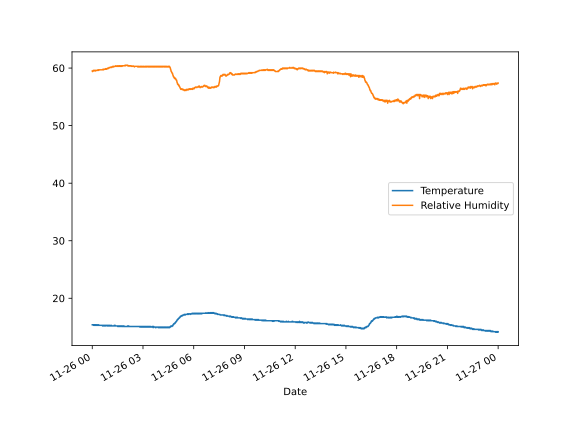
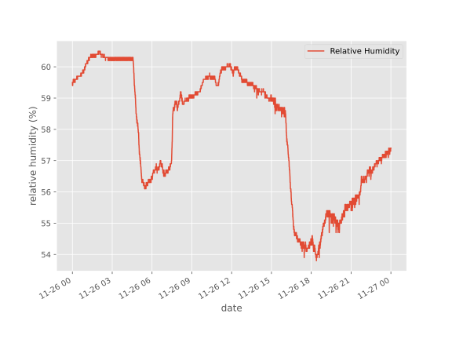

## Use the Pandas library to do statistics on tabular data.

*   Pandas is a widely-used Python library for statistics, particularly on tabular data.
*   Borrows many features from R's dataframes.
    *   A 2-dimensional table whose columns have names
        and potentially have different data types.
*   Load it with `import pandas as pd`. The alias pd is commonly used for Pandas.
*   Read a Comma Separated Values (CSV) data file with `pd.read_csv`.
    *   Argument is the name of the file to be read.
    *   Assign result to a variable to store the data that was read.

~~~
import pandas as pd

data = pd.read_csv('data/temp_rh_2021-11-26.csv')
print(data)
~~~
{: .language-python}
~~~
                     Date  Temperature  Relative Humidity
0     2021-11-26 00:00:08         15.4               59.5
1     2021-11-26 00:00:18         15.4               59.4
2     2021-11-26 00:00:28         15.4               59.4
3     2021-11-26 00:00:38         15.4               59.5
4     2021-11-26 00:00:48         15.4               59.5
...                   ...          ...                ...
8617  2021-11-26 23:59:14         14.2               57.4
8618  2021-11-26 23:59:24         14.1               57.4
8619  2021-11-26 23:59:34         14.1               57.4
8620  2021-11-26 23:59:44         14.1               57.4
8621  2021-11-26 23:59:54         14.2               57.4

[8622 rows x 3 columns]
~~~
{: .output}

*   The columns in a DataFrame are the observed variables, and the rows are the observations.
*   Pandas uses backslash `\` to show wrapped lines when output is too wide to fit the screen.

> ## File Not Found
>
> Our lessons store their data files in a `data` sub-directory,
> which is why the path to the file is `data/temp_rh_2021-11-26.csv`.
> If you forget to include `data/`,
> or if you include it but your copy of the file is somewhere else,
> you will get a [runtime error]({{ page.root }}/04-built-in/#runtime-error)
> that ends with a line like this:
>
> ~~~
> FileNotFoundError: [Errno 2] No such file or directory: 'data/temp_rh_2021-11-26.csv`
> ~~~
> {: .error}
{: .callout}

## Use `index_col` to specify that a column's values should be used as row headings.

*   Row headings are numbers (0 and 1 in this case).
*   Really want to index by date.
*   Pass the name of the column to `read_csv` as its `index_col` parameter to do this.

~~~
data = pd.read_csv('data/temp_rh_2021-11-26.csv', index_col='Date')
print(data)
~~~
{: .language-python}
~~~
                     Temperature  Relative Humidity
Date                                               
2021-11-26 00:00:08         15.4               59.5
2021-11-26 00:00:18         15.4               59.4
2021-11-26 00:00:28         15.4               59.4
2021-11-26 00:00:38         15.4               59.5
2021-11-26 00:00:48         15.4               59.5
...                          ...                ...
2021-11-26 23:59:14         14.2               57.4
2021-11-26 23:59:24         14.1               57.4
2021-11-26 23:59:34         14.1               57.4
2021-11-26 23:59:44         14.1               57.4
2021-11-26 23:59:54         14.2               57.4

[8622 rows x 2 columns]
~~~
{: .output}

## Use the `DataFrame.info()` method to find out more about a DataFrame.

~~~
data.info()
~~~
{: .language-python}
~~~
<class 'pandas.core.frame.DataFrame'>
Index: 8622 entries, 2021-11-26 00:00:08 to 2021-11-26 23:59:54
Data columns (total 2 columns):
 #   Column             Non-Null Count  Dtype  
---  ------             --------------  -----  
 0   Temperature        8622 non-null   float64
 1   Relative Humidity  8622 non-null   float64
dtypes: float64(2)
memory usage: 460.1+ KB
~~~
{: .output}

*   This is a `DataFrame`
*   8,622 rows
*   Two columns, 'Temperature' and 'Relative Humidity'
*   Uses 460KB of memory.

## The `DataFrame.columns` variable stores information about the DataFrame's columns.

*   Note that this is data, *not* a method.  (It doesn't have parentheses.)
    *   Like `math.pi`.
    *   So do not use `()` to try to call it.
*   Called a *member variable*, or just *member*.

~~~
print(data.columns)
~~~
{: .language-python}
~~~
Index(['Temperature', 'Relative Humidity'], dtype='object')
~~~
{: .output}

## Use `DataFrame.T` to transpose a DataFrame.

*   Sometimes want to treat columns as rows and vice versa.
*   Transpose (written `.T`) doesn't copy the data, just changes the program's view of it.
*   Like `columns`, it is a member variable.

~~~
print(data.T)
~~~
{: .language-python}
~~~
Date               2021-11-26 00:00:08  2021-11-26 00:00:18  \
Temperature                       15.4                 15.4   
Relative Humidity                 59.5                 59.4   

Date               2021-11-26 00:00:28  2021-11-26 00:00:38  \
Temperature                       15.4                 15.4   
Relative Humidity                 59.4                 59.5   

Date               2021-11-26 00:00:48  2021-11-26 00:00:58  \
Temperature                       15.4                 15.4   
Relative Humidity                 59.5                 59.5   

Date               2021-11-26 00:01:08  2021-11-26 00:01:18  \
Temperature                       15.4                 15.4   
Relative Humidity                 59.4                 59.4   

Date               2021-11-26 00:01:28  2021-11-26 00:01:38  ...  \
Temperature                       15.4                 15.4  ...   
Relative Humidity                 59.5                 59.5  ...   

Date               2021-11-26 23:58:24  2021-11-26 23:58:34  \
Temperature                       14.1                 14.2   
Relative Humidity                 57.3                 57.4   

Date               2021-11-26 23:58:44  2021-11-26 23:58:54  \
Temperature                       14.1                 14.1   
Relative Humidity                 57.4                 57.3   

Date               2021-11-26 23:59:04  2021-11-26 23:59:14  \
Temperature                       14.1                 14.2   
Relative Humidity                 57.4                 57.4   

Date               2021-11-26 23:59:24  2021-11-26 23:59:34  \
Temperature                       14.1                 14.1   
Relative Humidity                 57.4                 57.4   

Date               2021-11-26 23:59:44  2021-11-26 23:59:54  
Temperature                       14.1                 14.2  
Relative Humidity                 57.4                 57.4  

[2 rows x 8622 columns]
~~~
{: .output}

## Use `DataFrame.describe()` to get summary statistics about data.

`DataFrame.describe()` gets the summary statistics of only the columns that have numerical data. 
All other columns are ignored, unless you use the argument `include='all'`.
~~~
print(data.describe())
~~~
{: .language-python}
~~~
       Temperature  Relative Humidity
count  8621.000000        8621.000000
mean     15.823396          57.953254
std       0.838591           2.017624
min      14.100000          53.800000
25%      15.100000          56.400000
50%      15.800000          58.800000
75%      16.500000          59.700000
max      17.500000          60.500000
~~~
{: .output}

## Accessing values by column

To access the values in a particular column, the column name can be accessed from the DataFrame in a similar way to accessing values in a list by index. To access the `Relative Humidity` values:

~~~
print(data['Relative Humidity'])
~~~
{: .language-python}

~~~
Date
2021-11-26 00:00:08    59.5
2021-11-26 00:00:18    59.4
2021-11-26 00:00:28    59.4
2021-11-26 00:00:38    59.5
2021-11-26 00:00:48    59.5
                       ... 
2021-11-26 23:59:14    57.4
2021-11-26 23:59:24    57.4
2021-11-26 23:59:34    57.4
2021-11-26 23:59:44    57.4
2021-11-26 23:59:54    57.4
Name: Relative Humidity, Length: 8622, dtype: float64
~~~
{: .output}

The index column, which is `Date` in this example can not be accessed in this way, but is instead accessed using the `index` property of the DataFrame:

~~~
print(data.index)
~~~
{: .language-python}

~~~
Index(['2021-11-26 00:00:08', '2021-11-26 00:00:18', '2021-11-26 00:00:28',
       '2021-11-26 00:00:38', '2021-11-26 00:00:48', '2021-11-26 00:00:58',
       '2021-11-26 00:01:08', '2021-11-26 00:01:18', '2021-11-26 00:01:28',
       '2021-11-26 00:01:38',
       ...
       '2021-11-26 23:58:24', '2021-11-26 23:58:34', '2021-11-26 23:58:44',
       '2021-11-26 23:58:54', '2021-11-26 23:59:04', '2021-11-26 23:59:14',
       '2021-11-26 23:59:24', '2021-11-26 23:59:34', '2021-11-26 23:59:44',
       '2021-11-26 23:59:54'],
      dtype='object', name='Date', length=8622)
~~~
{: .output}

## Plotting a DataFrame

First, we will re-read the CSV file, telling Pandas to parse the 'Date' values to convert them in to Pandas `Timestamp` objects:

~~~
data = pd.read_csv('data/temp_rh_2021-11-26.csv', index_col='Date', parse_dates=['Date'])
data.head()
~~~
{: .language-python}

What does the `data.head()` function do? What do you think `data.tail()` might do?

Pandas makes quick plotting of data very simple:

~~~
data.plot()
~~~
{: .language-python}
 

A specific column can be plotted, by using the `y`  argument:

~~~
plt.style.use('ggplot')
data.plot(y='Relative Humidity')
plt.ylabel('relative humidity (%)')
plt.xlabel('date')
~~~
{: .language-python}

Note how we have changes the style of the plot using `plt.style.use('ggplot')`.

Running `plt.style.use('default')` will switch back to using the default style.

> ## Reading Other Data
>
> Read the data in `temp_rh_2021-11-27.csv`
> (which should be in the same directory as `temp_rh_2021-11-26.csv`)
> into a variable called `more_data`,
> display its summary statistics, and plot the values.
>
> > ## Solution
> > To read in a CSV, we use `pd.read_csv` and pass the filename `'data/temp_rh_2021-11-27.csv'` to it.
> > The summary statistics can be displayed with the `DataFrame.describe()` method.
> > `more_data.plot()` will plot the values.
> > ~~~
> > more_data = pd.read_csv('data/temp_rh_2021-11-27.csv', index_col='Date', parse_dates=['Date'])
> > print(more_data.describe())
> > more_data.plot()
> > ~~~
> >{: .language-python}
> {: .solution}
{: .challenge}

> ## Writing Data
> 
> As well as the `read_csv` function for reading data from a file,
> Pandas provides a `to_csv` function to write DataFrames to files.
> Applying what you've learned about reading from files,
> write one of your DataFrames to a file called `processed.csv`.
> You can use `help` to get information on how to use `to_csv`.
> > ## Solution
> > In order to write the DataFrame `more_data` to a file called `processed.csv`, execute the following command:
> > ~~~
> > more_data.to_csv('processed.csv')
> > ~~~
> >{: .language-python}
> > For help on `to_csv`, you could execute, for example:
> > ~~~
> > help(more_data.to_csv)
> > ~~~
> >{: .language-python}
> > Note that `help(to_csv)` throws an error! This is a subtlety and is due to the fact that `to_csv` is NOT a function in 
> > and of itself and the actual call is `more_data.to_csv`. 
> {: .solution}
{: .challenge}
