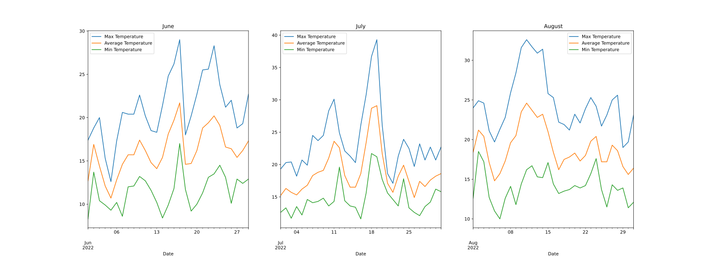
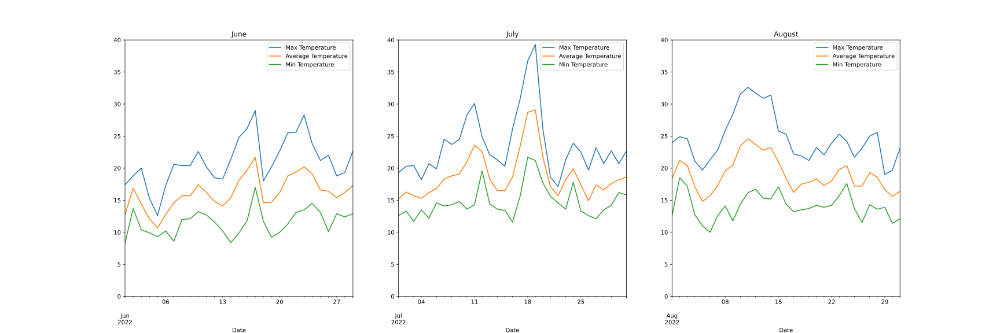

Python provides a data type called a dictionary, which is similar to a list in that it is a collection of objects.

Dictionaries and lists share the following characteristics:

* Both are mutable.
* Both are dynamic. They can grow and shrink as needed.
* Both can be nested. A list can contain another list. A dictionary can contain another dictionary. A dictionary can also contain a list, and vice versa.

Dictionaries differ from lists primarily in how elements are accessed:

* List elements are accessed by their position in the list, via indexing.
* Dictionary elements are accessed via keys.

This section aims to provide a good sense of when a dictionary is the appropriate data type to use, and how to do so.

## Creating a dictionary

We can define a dictionary by enclosing a comma-separated list of key-value pairs in curly braces (`{}`). A colon (`:`) separates each key from its associated value:

~~~
person = {
    'name': 'Ahmed',
    'age': 42
}
~~~
{: .language-python}

Once  we have defined a dictionary, we can inspect its type and values:

~~~
print(type(person))
print(person)
~~~
{: .language-python}
~~~
<class 'dict'>
{'name': 'Ahmed', 'age': 42}
~~~
{: .output}

A value is retrieved from a dictionary by specifying its corresponding key in square brackets (`[]`):

~~~
print(person['name'])
print(person['age'])
~~~
{: .language-python}
~~~
Ahmed
42
~~~
{: .output}

## Updating a dictionary

Let's create a dictionary, containing the details for multiple individuals, where the details for each individual are also stored as dictionaries:

~~~
people = {
    'Ahmed': {
        'age': 42
    },
    'Cheryl': {
        'age': 33
    }
}

print(people)
~~~
{: .language-python}
~~~
{'Ahmed': {'age': 42}, 'Cheryl': {'age': 33}}
~~~
{: .output}

We can add a new entry to a dictionary by defining a new key:

~~~
people['Susan'] = {'age': 25}

print(people)
~~~
{: .language-python}
~~~
{'Ahmed': {'age': 42}, 'Cheryl': {'age': 33}, 'Susan': {'age': 25}}
~~~
{: .output}

An existing value in a dictionary can be updated by redefining the value associated with an existing key:

~~~
people['Cheryl']['age'] = 34

print(people)
~~~
{: .language-python}
~~~
{'Ahmed': {'age': 42}, 'Cheryl': {'age': 34}, 'Susan': {'age': 25}}
~~~
{: .output}

The available keys in a dictionary can be accessed using the dictionary's `.keys()` method:

~~~
print(people.keys())
~~~
{: .language-python}
~~~
dict_keys(['Ahmed', 'Cheryl', 'Susan'])
~~~
{: .output}

## Using a dictionary to store data

In our `data/` directory, we have three files containing temperature data for June, July and August 2022:

* `data/temperature_2022-06.csv`
* `data/temperature_2022-07.csv`
* `data/temperature_2022-08.csv`

We can create a dictionary to store this information:

~~~
temp_files = {
    'June': 'data/temperature_2022-06.csv',
    'July': 'data/temperature_2022-07.csv',
    'August': 'data/temperature_2022-08.csv'
}

print(temp_files)
~~~
{: .language-python}
~~~
{'June': 'data/temperature_2022-06.csv', 'July': 'data/temperature_2022-07.csv', 'August': 'data/temperature_2022-08.csv'}
~~~
{: .output}

If we would like to create a single figure containing three plots, one for each month, we can do this by accessing values from the dictionary:

~~~
# Create the subplot axes, with a single row and three columns:
fig, axs = plt.subplots(nrows=1, ncols=3)

# Set the figure size:
fig.set_figwidth(24)
fig.set_figheight(8)

# Plot June data
# access the axes for this plot:
ax = axs[0]
# Set the month name:
month = 'June'
# Read the data for this month using Pandas:
data = pd.read_csv(temp_files[month], index_col='Date', parse_dates=['Date'])
# Plot the data using the Pandas DataFrame plot function:
data.plot(ax=ax)
# Set the plot title:
ax.set_title(month)

# Plot July data
# access the axes for this plot:
ax = axs[1]
# Set the month name:
month = 'July'
# Read the data for this month using Pandas:
data = pd.read_csv(temp_files[month], index_col='Date', parse_dates=['Date'])
# Plot the data using the Pandas DataFrame plot function:
data.plot(ax=ax)
# Set the plot title:
ax.set_title(month)

# Plot August data
# access the axes for this plot:
ax = axs[2]
# Set the month name:
month = 'August'
# Read the data for this month using Pandas:
data = pd.read_csv(temp_files[month], index_col='Date', parse_dates=['Date'])
# Plot the data using the Pandas DataFrame plot function:
data.plot(ax=ax)
# Set the plot title:
ax.set_title(month)
~~~
{: .language-python}

The three plots in the figure do not have the same y axis limits, which makes it difficult to compare the values.

We can fix this by setting the y axis limits, using the [`set_ylim`](https://matplotlib.org/stable/api/_as_gen/matplotlib.axes.Axes.set_ylim.html) function:

~~~
# Create the subplot axes, with a single row and three columns:
fig, axs = plt.subplots(nrows=1, ncols=3)

# Set the figure size:
fig.set_figwidth(24)
fig.set_figheight(8)

# Plot June data
# access the axes for this plot:
ax = axs[0]
# Set the month name:
month = 'June'
# Read the data for this month using Pandas:
data = pd.read_csv(temp_files[month], index_col='Date', parse_dates=['Date'])
# Plot the data using the Pandas DataFrame plot function:
data.plot(ax=ax)
# Set the y axis limits:
ax.set_ylim((0, 40))
# Set the plot title:
ax.set_title(month)

# Plot July data
# access the axes for this plot:
ax = axs[1]
# Set the month name:
month = 'July'
# Read the data for this month using Pandas:
data = pd.read_csv(temp_files[month], index_col='Date', parse_dates=['Date'])
# Plot the data using the Pandas DataFrame plot function:
data.plot(ax=ax)
# Set the y axis limits:
ax.set_ylim((0, 40))
# Set the plot title:
ax.set_title(month)

# Plot August data
# access the axes for this plot:
ax = axs[2]
# Set the month name:
month = 'August'
# Read the data for this month using Pandas:
data = pd.read_csv(temp_files[month], index_col='Date', parse_dates=['Date'])
# Plot the data using the Pandas DataFrame plot function:
data.plot(ax=ax)
# Set the y axis limits:
ax.set_ylim((0, 40))
# Set the plot title:
ax.set_title(month)
~~~
{: .language-python}

> ## Plotting in a loop
>
> Can you recreate the figure above by looping through the values in the dictionary. You may wish to use the [`enumerate`](https://docs.python.org/3/library/functions.html#enumerate) function.
> > ## Solution
> >
> > ~~~
> > # Create the subplot axes, with a single row and three columns:
> > fig, axs = plt.subplots(nrows=1, ncols=3)
> > 
> > # Set the figure size:
> > fig.set_figwidth(24)
> > fig.set_figheight(8)
> > 
> > # Loop through dictionary keys, using the enumerate function:
> > for index, month in enumerate(temp_files.keys()):
> >     # Access the axes for this plot:
> >     ax = axs[index]
> >     # Set the month name from the dictoinary key name:
> >     month = month
> >     # Read the data for this month using Pandas:
> >     data = pd.read_csv(temp_files[month], index_col='Date', parse_dates=['Date'])
> >     # Plot the data using the Pandas DataFrame plot function:
> >     data.plot(ax=ax)
> >     # Set the y axis limits:
> >     ax.set_ylim((0, 40))
> >     # Set the plot title:
> >     ax.set_title(month)
> > ~~~
> > {: .language-python}
> >
> > 
> > 
> {: .solution}
{: .challenge}
