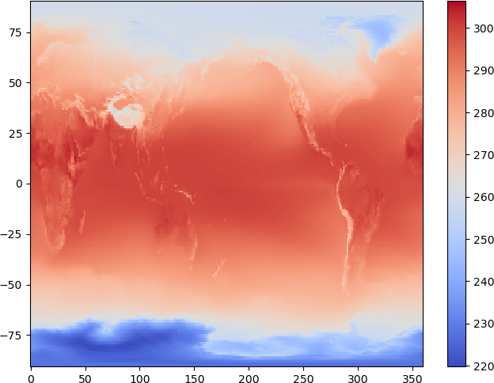
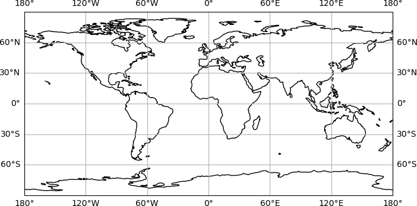
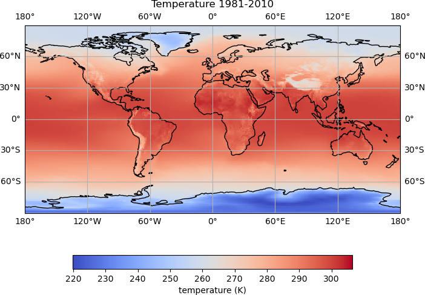

## Installing third party libraries with `conda`

The `conda` command line tool is used to manage packages and environments within an Anaconda installation.

From a terminal, or Anaconda prompt, the libraries we will be using can be installed with:

~~~
conda install -c conda-forge gdal cartopy iris
~~~

After installing these packages, it may be necessary to open a new terminal and launch a new Jupyter Lab session for things to work correctly.

* [GDAL](https://gdal.org/) is a translator library for raster and vector geospatial data formats
* [Cartopy](https://scitools.org.uk/cartopy/docs/latest/index.html) is designed for geospatial data processing in order to produce maps and other geospatial data analyses.
* [Iris](https://scitools-iris.readthedocs.io/en/stable/) is a powerful, format-agnostic, community-driven Python package for analysing and visualising Earth science data.

## Reading NetCDF data with Iris

Reading in a NetCDF file using Iris is done using the `load()` or `load_cube()` functions.

When using the `load()` function it will produce a list of _cubes_, one for each variable in the file:

~~~
import iris

cubes = iris.load('data/era5_2019-12-01.nc')
print(cubes)
~~~
{: .language-python}
~~~
0: 2 metre temperature / (K)           (time: 4; latitude: 256; longitude: 512)
1: air_pressure_at_mean_sea_level / (Pa) (time: 4; latitude: 256; longitude: 512)
~~~
{: .output}

We can see there are two variables in the file, *2 metre temperature* and *air_pressure_at_mean_sea_level*.

There is data for each variable at four different times, for 256 latitudes and 512 longitudes.

The variable `cubes` is an Iris *cube list*, and the variables in the list can be accessed by the index value:

~~~
print(cubes[0])
~~~
{: .language-python}
~~~
2 metre temperature / (K)           (time: 4; latitude: 256; longitude: 512)
    Dimension coordinates:
        time                             x            -               -
        latitude                         -            x               -
        longitude 
...
~~~
{: .output}

We can load a single variable from a file, by passing the variable name to Iris.

Variables in NetCDF files can contain multiple versions of the name. The name to use when loading a particular variable with Iris will be the same as we saw when looking at the `cubes` variable, so to load the 2m temperature variable, we use the name *2 metre temperature*:

~~~
temp = iris.load_cube('data/era5_2019-12-01.nc', '2 metre temperature')
print(temp)
~~~
{: .language-python}
~~~
2 metre temperature / (K)           (time: 4; latitude: 256; longitude: 512)
    Dimension coordinates:
        time                             x            -               -
        latitude                         -            x               -
        longitude 
...
~~~
{: .output}

The data values for an Iris cube can be found in the `data` property:

~~~
print(temp.data)
print(type(temp.data))
~~~
{: .language-python}
~~~
[[[252.43586188 252.43586188 252.43436441 ... 252.42477575 252.42758054
   252.43053221]
  [253.38298054 253.38287307 253.38582932 ... 253.31827111 253.33833145
   253.3602814 ]
  [254.21271246 254.18634479 254.15767645 ... 254.09464759 254.13549487
   254.17388604]
  ...
<class 'numpy.ma.core.MaskedArray'>
~~~
{: .output}

We can see that Iris stores data in a Numpy array. The type of array used to store the data is a `MaskedArray`, which means that values can be masked out, for example if there was only data for values over land, the points which not over land might be masked out.

As the data is a Numpy array, we can find out some more information about the shape of the array, and the values it contains:

~~~
print(temp.data.shape)
print(temp.data.min())
print(temp.data.max())
print(temp.data.mean())
~~~
{: .language-python}
~~~
(4, 256, 512)
224.61368740653367
316.40985990341267
278.0726358433255
~~~
{: .output}

The time, latitude and longitude information for the data can be accessed using the `coord` property of the cube:

~~~
print(temp.coord('time'))
print(temp.coord('latitude'))
print(temp.coord('longitude'))
~~~
{: .language-python}
~~~
DimCoord([2019-12-01 00:00:00, 2019-12-01 06:00:00, 2019-12-01 12:00:00,
       2019-12-01 18:00:00], standard_name='time', calendar='gregorian', long_name='time', var_name='time')
DimCoord(array([ 89.462944  ,  88.766945  ,  88.06699   ,  87.366035  ,
        86.6648    ,  85.96337   ,  85.26186   ,  84.56026   ,
        83.858635  ,  83.15699   ,  82.455315  ,  81.75364   ,
...
~~~
{: .output}

We would like to plot the data from the first time step in the file (2019-12-01 00:00:00), so we will extract the values we need:

~~~
lons = temp.coord('longitude').points
lats = temp.coord('latitude').points
temp_data = temp.data[0]
print(lons.shape)
print(lats.shape)
print(temp_data.shape)
~~~
{: .language-python}
~~~
(512,)
(256,)
(256, 512)
~~~
{: .output}

We now have 512 longitude values, 256 latitude values and 256*512 temperature values.

Previously we have created line plots. There are various ways to plot 2d data, and we will use the [`pcolormesh`](https://matplotlib.org/stable/api/_as_gen/matplotlib.pyplot.pcolormesh.html) function to plot the temperature data:

~~~
plt.pcolormesh(lons, lats, temp_data, cmap='coolwarm')
plt.colorbar()
~~~
{: .language-python}

## Using Cartopy to plot data on a map

Now we have loaded some geospatial data, we can use the Cartopy package to plot the data on a map.

Cartopy can plot data in various [projections](https://scitools.org.uk/cartopy/docs/latest/reference/projections.html#cartopy-projections), we will create some axes for our plot using the [*PlateCarree*](https://en.wikipedia.org/wiki/Equirectangular_projection), and add the costlines to the plot:

~~~
import cartopy

map_projection = cartopy.crs.PlateCarree()

map_axes = plt.axes(projection=map_projection)
map_axes.add_feature(cartopy.feature.COASTLINE)
~~~
{: .language-python}

There are several other basic features which can be added to a map using Cartopy. These include:

* COASTLINE
* BORDERS
* LAKES
* LAND
* OCEAN
* RIVERS

We can also add gridlines to the map with `map_ax.gridlines()`:

~~~
map_projection = cartopy.crs.PlateCarree()

map_axes = plt.axes(projection=map_projection)
map_axes.add_feature(cartopy.feature.COASTLINE)
map_axes.gridlines(draw_labels=True, xlocs=np.arange(-180, 181, 90), ylocs=np.arange(-90, 91, 60))
~~~
{: .language-python}

Next we will add our temperature data to the map. When working with Matplotlib axes as we are here, the plotting functions become a method of the axes, so rather than `plt.pcolormesh()`, we will use `map_axes.pcolormesh()`:

~~~
# Set map projection:
map_projection = cartopy.crs.PlateCarree()
# Create the plot axes:
map_axes = plt.axes(projection=map_projection)
# Add gridlines to the map:
map_axes.gridlines(draw_labels=True, linestyle='--', xlocs=np.arange(-180, 181, 90), ylocs=np.arange(-90, 91, 60))
# Plot the temperature data:
temp_plot = map_axes.pcolormesh(lons, lats, temp_data, shading='auto', edgecolors='face', cmap='coolwarm')
# Add coastlines to the map:
map_axes.add_feature(cartopy.feature.COASTLINE)
# Add a colour scale:
cbar = plt.colorbar(temp_plot, orientation='horizontal', fraction=0.05)
# Set the colour bar label:
cbar.set_label('temperature (K)')
# Set the plot title:
map_axes.set_title('2m Temperature')
~~~
{: .language-python}

There is now quite a lot going on to create the plot, and we can see how adding comments helps to keep track of what is being done.

* We first set the projection for the plot (`map_projection =`)
* The axes for the plot are created using `plot.axes()`
* Coastlines are added to the plot using `map_axes.add_feature()`
* Gridlines are added using `map_ax.gridlines()`
* The temperature data is plotted using `map_axes.pcolormesh()` and the plot object is stored as `temp_plot`
* A colour scale is added using `plt.colorbar()` to which we pass the `temp_plot` object. The colour scale object is stored as `cbar`.
* The label for the colour scale is set with `cbar.set_label()`.
* Finally, we set the plot title using `map_axes.set_title()`

> ## Plotting data from a different time step
>
> How would you plot the data from the second time step in the NetCDF file, using the `Orthographic` projection?
>
> You will need to add the following argument to the `pcolormesh()` command, so that the data points are correctly projected:
> ~~~
> transform=cartopy.crs.PlateCarree()
> ~~~
> {: .language-python}
> > ## Solution
> > ~~~
> > # Get the lat and lon values for the data:
> > lons = temp.coord('longitude').points
> > lats = temp.coord('latitude').points
> > # Get the temperature data for the second time step:
> > temp_data = temp.data[1]
> > # Set map projection:
> > map_projection = cartopy.crs.Orthographic()
> > # Create the plot axes:
> > map_axes = plt.axes(projection=map_projection)
> > # Add gridlines to the map:
> > map_axes.gridlines(draw_labels=True, linestyle='--', xlocs=np.arange(-180, 181, 90), ylocs=np.arange(-90, 91, 60))
> > # Plot the temperature data:
> > temp_plot = map_axes.pcolormesh(lons, lats, temp_data, shading='auto', edgecolors='face', cmap='coolwarm', transform=cartopy.crs.PlateCarree())
> > # Add coastlines to the map:
> > map_axes.add_feature(cartopy.feature.COASTLINE)
> > # Add a colour scale:
> > cbar = plt.colorbar(temp_plot, orientation='horizontal', fraction=0.05)
> > # Set the colour bar label:
> > cbar.set_label('temperature (K)')
> > # Set the plot title:
> > map_axes.set_title('2m Temperature')
> > ~~~
> > {: .language-python}
> > 
> {: .solution}
{: .challenge}

## Reading GeoTIFF  data with GDAL

There is some ice velocity data in the file `data/measures_iv.tif`. This is MEaSUREs ice velocity data, collected from the period 1996 to 2016.

We can use the GDAL library to read this data in to a Numpy array:

~~~
from osgeo import gdal

# Open the GeoTIFF file:
iv_raster = gdal.Open('data/measures_iv.tif')
# Read the ice velocity data in to a NumPy array:
iv_data = iv_raster.ReadAsArray()

# Print some information about the data:
print(iv_data.shape)
print(iv_data.max())
~~~
{: .language-python}
~~~
(560, 560)
4107.542
~~~
{: .output}

The GeoTIFF file does not contain any information about the units of the values, which are in m/year.

We can get some information about the projection and coordinates of the data, using the `GetSpatialRef` and `GetGeoTransform` functions:

~~~
print(iv_raster.GetSpatialRef())
print(iv_raster.GetGeoTransform())
~~~
{: .language-python}
~~~
LOCAL_CS["WGS_1984_Antarctic_Polar_Stereographic",
    UNIT["metre",1,
        AUTHORITY["EPSG","9001"]],
    AXIS["Easting",EAST],
    AXIS["Northing",NORTH]]
(-2800225.0, 10000.0, 0.0, 2800225.0, 0.0, -10000.0)
~~~
{: .output}

We can see that the data is in an antarctic Polar Stereographic projection, and the GeoTransform gives us some information about the coordinates of each pixel.

The [GDAL documentation](https://gdal.org/tutorials/geotransforms_tut.html) provides lots of information about GeoTransforms.

We can work out the x and y coordinates of each pixel, using the GeoTransform information. The first value in the GeoTransform data is x coordinate of the upper left pixel, and the second value is the difference between each pixel x coordinate. The fourth value is the y coordinate of the upper left pixel and the sixth value is the difference between each y pixel coordinate.

With this information we can work out the x and y values:

~~~
# Get the GeoTIFF GeoTransform:
iv_gt = iv_raster.GetGeoTransform()

# The number of x coordinates is the second value in iv_data.shape:
iv_x_sz = iv_data.shape[1]
# Create an array of pixel index values, which will be 0 to 559 in this case:
iv_x_indexes = np.arange(0, iv_x_sz)
# Get the minimum x value and the x increment value:
iv_x_min = iv_gt[0]
iv_x_inc = iv_gt[1]
# Work out the x coordinate values:
iv_x = iv_x_min + (iv_x_indexes * iv_x_inc)

# The number of y coordinates is the first value in iv_data.shape:
iv_y_sz = iv_data.shape[0]
# Create an array of pixel index values, which will be 0 to 559 in this case:
iv_y_indexes = np.arange(0, iv_y_sz)
# Get the minimum x value and the x increment value:
iv_y_min = iv_gt[3]
iv_y_inc = iv_gt[5]
# Work out the y coordinate values:
iv_y = iv_y_min + (iv_y_indexes * iv_y_inc)
~~~
{: .language-python}

Read through each line carefully, and think about what it is doing.

The data includes pixels for which there is no data. We can check the no data value, which in this case is -3.402823e+38.

We will set any pixels with a value less than 0 to NaN:

~~~
# Check the no data value:
iv_nodata = iv_raster.GetRasterBand(1).GetNoDataValue()
print('No data value: ', iv_nodata)
# Set no data values to NaN:
iv_data[iv_data == iv_nodata] = np.nan
~~~
{: .language-python}
~~~
No data value:  -3.402823e+38
~~~
{: .output}

We can check the x and y coordinates we have calculated are of the expected size:

~~~
# Print some information about the data:
print(iv_x.shape)
print(iv_y.shape)
~~~
{: .language-python}
~~~
(560,)
(560,)
~~~
{: .output}

Lets see if we can plot the ice velocity data on a map. This time, we will use the `SouthPolarStereo` projection:

~~~
# Set map projection:
map_projection = cartopy.crs.SouthPolarStereo()
# Create the plot axes:
map_axes = plt.axes(projection=map_projection)
# Add gridlines to the map:
map_axes.gridlines(draw_labels=True, linestyle='--',
                   xlocs=np.arange(-180, 181, 60),
                   ylocs=np.arange(-80, -51, 10))
# Plot the ice velovity data:
temp_plot = map_axes.pcolormesh(iv_x, iv_y, iv_data, cmap='hot_r', vmin=0, vmax=1000)
# Add coastlines to the map:
map_axes.add_feature(cartopy.feature.COASTLINE)
# Add a colour scale:
cbar = plt.colorbar(temp_plot, pad=0.1)
# Set the colour bar label:
cbar.set_label('ice velocity (m/year)')
# Set the plot title:
map_axes.set_title('Ice Velocity')
~~~
{: .language-python}

What properties have we changed compared to the earlier temperature plots?
