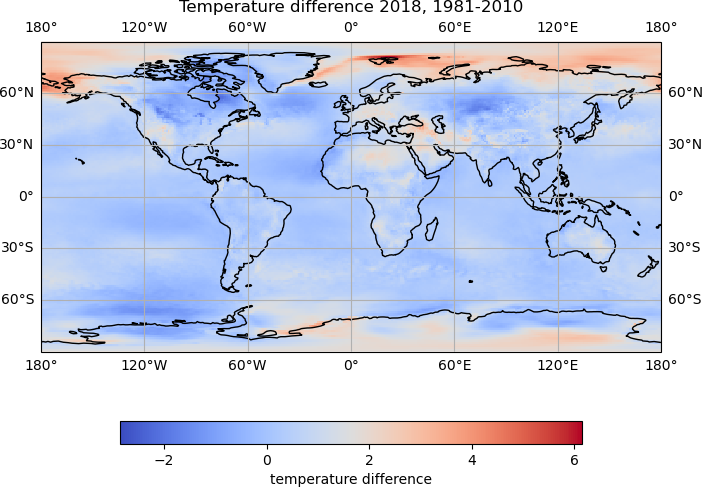
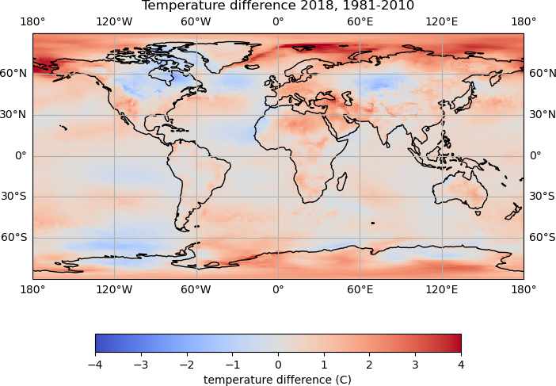
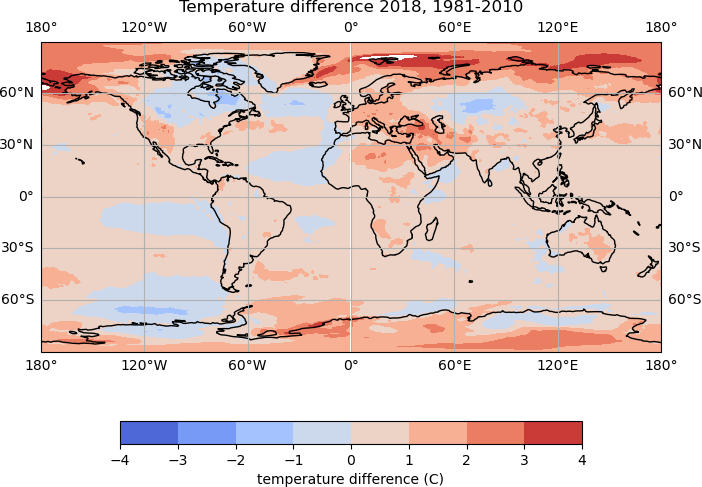

## Installing additional libraries with `conda`

The `conda` command line tool is used to manage packages and environments within an Anaconda installation.

From a terminal, or Anaconda prompt, the libraries we will be using can be installed with:

~~~
conda install -y -c conda-forge iris cartopy
~~~

After installing these packages, it may be necessary to open a new terminal and launch a new Jupyter Lab session for things to work correctly.

* [Iris](https://scitools-iris.readthedocs.io/en/stable/) is a powerful, format-agnostic, community-driven Python package for analysing and visualising Earth science data.
* [Cartopy](https://scitools.org.uk/cartopy/docs/latest/index.html) is designed for geospatial data processing in order to produce maps and other geospatial data analyses.
## Reading NetCDF data with Iris

Reading in a NetCDF file using Iris is done using the `load()` or `load_cube()` functions.

We have been provided some NetCDF files containing ERA5 global temperature data from the ECMWF.

The file `data/era5_mean_temp_1981-2010.nc` contains the global mean temperature data for 1981 to 2010. The file `data/era5_mean_annual_temp_2018-2022.nc` contains global annual mean temperatures for the years 2018 to 2022.

The files we will be looking at contain a single variable, so we can load data from our first file with the `load_cube()` function:

~~~
import iris

hist_temp = iris.load_cube('data/era5_mean_temp_1981-2010.nc')
print(hist_temp)
~~~
{: .language-python}
~~~
2 metre temperature / (K)           (latitude: 181; longitude: 360)
    Dimension coordinates:
        latitude                             x               -
        longitude                            -               x
    Scalar coordinates:
        expver                      1
        time                        1995-12-17 00:00:00, bound=(1981-01-01 00:00:00, 2010-12-01 00:00:00)
    Cell methods:
        0                           time: mean
    Attributes:
        Conventions                 'CF-1.7'
        history                     '2023-12-10 09:47:57 GMT by grib_to_netcdf-2.25.1: /opt/ecmwf/mars-client/bin/grib_to_netcdf.bin ...'
~~~
{: .output}

The `hist_temp` object is an iris _cube_. This object contains the
variable data as well as related metadata.

~~~
print(type(hist_temp))
~~~
{: .language-python}
~~~
<class 'iris.cube.Cube'>
~~~
{: .output}

> ## Loading data from files containing multiple variables
>
> When using the iris `load()` function it will produce a list of _cubes_, one for each variable in the file, which may look similar to this:
>
> ~~~
> cubes = iris.load('data/20191201.nc')
> print(cubes)
> ~~~
> {: .language-python}
> ~~~
> 0: 2 metre temperature / (K)           (time: 4; latitude: 256; longitude: 512)
> 1: air_pressure_at_mean_sea_level / (Pa) (time: 4; latitude: 256; longitude: 512)
> ~~~
> {: .output}
>
> We can see there are two variables in the file, *2 metre temperature* and *air_pressure_at_mean_sea_level*.
>
> The variable `cubes` is an Iris *cube list*, and the variables in the list can be accessed by the index value:
>
> ~~~
> print(cubes[0])
> ~~~
> {: .language-python}
> ~~~
> 2 metre temperature / (K)           (time: 4; latitude: 256; longitude: 512)
>     Dimension coordinates:
>         time                             x            -               -
>         latitude                         -            x               -
>         longitude
> ...
> ~~~
> {: .output}
>
> We can load a single variable from a file, by passing the variable name to Iris.
>
> Variables in NetCDF files can contain multiple versions of the name. The name to use when loading a particular variable with Iris will be the same as we saw when looking at the `cubes` variable, so to load the 2m temperature variable, we use the name *2 metre temperature*:
>
> ~~~
> temp = iris.load_cube('data/20191201.nc', '2 metre temperature')
> print(temp)
> ~~~
> {: .language-python}
> ~~~
> 2 metre temperature / (K)           (time: 4; latitude: 256; longitude: 512)
>     Dimension coordinates:
>         time                             x            -               -
>         latitude                         -            x               -
>         longitude
> ...
> ~~~
> {: .output}
{: .callout}

The data values for an Iris cube can be found in the `data` property:

~~~
print(hist_temp.data)
print(type(hist_temp.data))
~~~
{: .language-python}
~~~
[[258.93490373 258.93490373 258.93490373 ... 258.93490373 258.93490373
  258.93490373]
 [259.1283197  259.13209851 259.13575203 ... 259.12782856 259.12798893
  259.12817938]
 [259.32918805 259.33184424 259.33421477 ... 259.31327094 259.31432339
  259.32189605]
 ...
 [228.46974617 228.43380738 228.39738245 ... 228.53184095 228.5038557
  228.48709162]
 [228.06460655 228.0546333  228.0449006  ... 228.10377788 228.09062722
  228.07752166]
 [227.69386212 227.69386212 227.69386212 ... 227.69386212 227.69386212
  227.69386212]]
<class 'numpy.ma.core.MaskedArray'>
~~~
{: .output}

We can see that Iris stores data in a Numpy array. The type of array used to store the data is a `MaskedArray`, which means that values can be masked out, for example if there was only data for values over land, the points which were in ocean areas may be masked out.

As the data is a Numpy array, we can find out some more information about the shape of the array, and the values it contains:

~~~
print(hist_temp.data.shape)
print(hist_temp.data.min())
print(hist_temp.data.max())
print(hist_temp.data.mean())
~~~
{: .language-python}
~~~
(181, 360)
219.82352664773725
306.46696949834524
278.2130725081754
~~~
{: .output}

The time, latitude and longitude information for the data can be accessed using the `coord` property of the cube:

~~~
print(hist_temp.coord('time'))
print(hist_temp.coord('latitude'))
print(hist_temp.coord('longitude'))
~~~
{: .language-python}
~~~
DimCoord :  time / (hours since 1900-01-01 00:00:00.0, standard calendar)
    points: [1995-12-17 00:00:00]
    bounds: [[1981-01-01 00:00:00, 2010-12-01 00:00:00]]
    shape: (1,)  bounds(1, 2)
    dtype: int32
    standard_name: 'time'
    long_name: 'time'
    var_name: 'time'
DimCoord :  latitude / (degrees)
    points: [ 90.,  89., ..., -89., -90.]
    shape: (181,)
...
~~~
{: .output}

We would like to plot the data to see what it looks like, so will extract the values we need:

~~~
lons = hist_temp.coord('longitude').points
lats = hist_temp.coord('latitude').points
hist_temp_data = hist_temp.data
print(lons.shape)
print(lats.shape)
print(hist_temp_data.shape)
~~~
{: .language-python}
~~~
(360,)
(181,)
(181, 360)
~~~
{: .output}

We have 360 longitude values, 181 latitude values and 360*181 temperature values.

Previously we have created line plots. There are various ways to plot 2d data, and we will use the [`pcolormesh`](https://matplotlib.org/stable/api/_as_gen/matplotlib.pyplot.pcolormesh.html) function to plot the temperature data:

~~~
plt.pcolormesh(lons, lats, hist_temp_data, cmap='coolwarm')
plt.colorbar()
~~~
{: .language-python}

## Using Cartopy to plot data on a map

Now we have loaded some geospatial data, we can use the Cartopy package to plot the data on a map.

Cartopy can plot data in various [projections](https://scitools.org.uk/cartopy/docs/latest/reference/projections.html#cartopy-projections), we will create some axes for our plot using the [*PlateCarree*](https://en.wikipedia.org/wiki/Equirectangular_projection), and add the costlines to the plot:

~~~
import cartopy

map_projection = cartopy.crs.PlateCarree()

map_axes = plt.axes(projection=map_projection)
map_axes.add_feature(cartopy.feature.COASTLINE)
map_axes.gridlines(draw_labels=True)
~~~
{: .language-python}

There are several other basic features which can be added to a map using Cartopy. These include:

* COASTLINE
* BORDERS
* LAKES
* LAND
* OCEAN
* RIVERS

We have added gridlines to the map with `map_ax.gridlines()` function.

Next we will add our temperature data to the map. When working with Matplotlib axes as we are here, the plotting functions become a method of the axes, so rather than `plt.pcolormesh()`, we will use `map_axes.pcolormesh()`:

~~~
# Set map projection:
map_projection = cartopy.crs.PlateCarree()
# Create the plot axes:
map_axes = plt.axes(projection=map_projection)
# Add gridlines to the map:
map_axes.gridlines(draw_labels=True)
# Plot the temperature data:
temp_plot = map_axes.pcolormesh(lons, lats, hist_temp_data, cmap='coolwarm')
# Add coastlines to the map:
map_axes.add_feature(cartopy.feature.COASTLINE)
# Add a colour scale:
cbar = plt.colorbar(temp_plot, orientation='horizontal', fraction=0.05)
# Set the colour bar label:
cbar.set_label('temperature (K)')
# Set the plot title:
map_axes.set_title('Temperature 1981-2010')
~~~
{: .language-python}

There is now quite a lot going on to create the plot, and we can see how adding comments helps to keep track of what is being done.

* We first set the projection for the plot (`map_projection =`)
* The axes for the plot are created using `plot.axes()`
* Coastlines are added to the plot using `map_axes.add_feature()`
* Gridlines are added using `map_ax.gridlines()`
* The temperature data is plotted using `map_axes.pcolormesh()` and the plot object is stored as `temp_plot`
* A colour scale is added using `plt.colorbar()` to which we pass the `temp_plot` object. The colour scale object is stored as `cbar`.
* The label for the colour scale is set with `cbar.set_label()`.
* Finally, we set the plot title using `map_axes.set_title()`

## Comparing historical data with recent annual data

We have annual temperature data for the years 2018-2022 in the file `data/era5_mean_annual_temp_2018-2022.nc` which we would like to complare with the historical data. We can load this data using iris:

~~~
ann_temp = iris.load_cube('data/era5_mean_annual_temp_2018-2022.nc')
print(ann_temp)
~~~
{: .language-python}
~~~
2 metre temperature / (K)           (time: 5; latitude: 181; longitude: 360)
    Dimension coordinates:
        time                             x            -               -
        latitude                         -            x               -
        longitude                        -            -               x
    Scalar coordinates:
        expver                      1
    Cell methods:
        0                           time: mean
    Attributes:
        Conventions                 'CF-1.7'
        history                     '2023-12-10 09:47:57 GMT by grib_to_netcdf-2.25.1: /opt/ecmwf/mars-client/bin/grib_to_netcdf.bin ...'
DimCoord :  time / (hours since 1900-01-01 00:00:00.0, standard calendar)
    points: [
        2018-06-17 00:00:00, 2019-06-17 00:00:00, 2020-06-16 12:00:00,
        2021-06-17 00:00:00, 2022-06-17 00:00:00]
    bounds: [
        [2018-01-01 00:00:00, 2018-12-01 00:00:00],
        [2019-01-01 00:00:00, 2019-12-01 00:00:00],
        [2020-01-01 00:00:00, 2020-12-01 00:00:00],
        [2021-01-01 00:00:00, 2021-12-01 00:00:00],
        [2022-01-01 00:00:00, 2022-12-01 00:00:00]]
    shape: (5,)  bounds(5, 2)
    dtype: int32
    standard_name: 'time'
    long_name: 'time'
    var_name: 'time'
~~~
{: .output}

We can see that this annual data has an additional _time_ dimension, i.e. there are 360*181 gridded temperature values at each time step.

~~~
print('shape of annual temp data:', ann_temp.data.shape)
print('shape of data for first time step:', ann_temp.data[0].shape)
~~~
{: .language-python}
~~~
shape of annual temp data: (5, 181, 360)
shape of data for first time step: (181, 360)
~~~
{: .output}

We would like to compare the temperature for each year in the `ann_temp` data to the historical data.

To avoided having to repeat code, we will create a function to plot the data:

~~~
def plot_temp_diff(ann_data, hist_data, year):
    """
    plot the difference between the annual data and the historical data
    """
    # Calculate the temperature difference:
    temp_diff = ann_data - hist_data
    # Set map projection:
    map_projection = cartopy.crs.PlateCarree()
    # Create the plot axes:
    map_axes = plt.axes(projection=map_projection)
    # Add gridlines to the map:
    map_axes.gridlines(draw_labels=True)
    # Plot the temperature data:
    temp_plot = map_axes.pcolormesh(lons, lats, temp_diff, cmap='coolwarm')
    # Add coastlines to the map:
    map_axes.add_feature(cartopy.feature.COASTLINE)
    # Add a colour scale:
    cbar = plt.colorbar(temp_plot, orientation='horizontal', fraction=0.05)
    # Set the colour bar label:
    cbar.set_label('temperature difference')
    # Set the plot title:
    map_axes.set_title(f'Temperature difference {year}, 1981-2010')
    # Display the plot:
    plt.show()
~~~
{: .language-python}

Once we have created the function, we can use this to plot the difference in the temperature data for a single year.

The data for 2018 is the first time step in the annual data, so to plot the difference between the historical data and the data for 2018:

~~~
plot_temp_diff(ann_temp.data[0], hist_temp_data, 2018)
~~~
{: .language-python}

To plot the differences for all years, we can loop through the data.

We can do this using the built in [`enumerate`](https://docs.python.org/3/library/functions.html#enumerate) function, which loops through a collection of items, and at each step of the loop provides the index and value, for example:

~~~
fruits = ['apples', 'bananas', 'raspberries']
colours = ['green', 'yellow', 'red']

for index, fruit in enumerate(fruits):
    colour = colours[index]
    print(fruit, 'are', colour)
~~~
{: .language-python}
~~~
apples are green
bananas are yellow
raspberries are red
~~~
{: .output}

We will define a range of years for which we have data, and use the `enumerate` function to loop through this list, and plot the corresponding data.

~~~
# get a range of years for which we have data, 2018 to 2022:
years = range(2018, 2023)

# loop through the years using enumerate:
for index, year in enumerate(years):
    # plot the difference between the historical data and the annual data
    # for this year:
    plot_temp_diff(ann_temp.data[index], hist_temp_data, year)
~~~
{: .language-python}

> ## Setting colour bounds
>
> It is difficult to compare the plots, as the colour bounds have automatically been set based on the data values, and are different for each plot.
>
> The colour bounds for the `pcolormesh` plot can with `vmin` and `vmax` arguments. Update the `plot_temp_diff` function, setting suitable values, and recreate the plots.
> {: .language-python}
> > ## Solution
> >
> > Suitable bounds for the colour values may be -4 to 4, and the `pcolormesh` line in the function could be updated to:
> > ~~~
> > temp_plot = map_axes.pcolormesh(lons, lats, temp_diff, cmap='coolwarm', vmin=-4, vmax=4)
> > ~~~
> > {: .language-python}
> >
> > This should produce plots which all have the same colour bounds
> > 
> {: .solution}
{: .challenge}

> ## Different plot types
>
> Different plot types may be suitable for different types of data. For our temperature data, we could try creating a filled contour plot, using the [`contourf`](https://matplotlib.org/stable/api/_as_gen/matplotlib.pyplot.contourf.html) function.
>
> Try updating the `plot_temp_diff` function to use the `contourf` function, rather than `pcolormesh`.
>
> Rather than `vmin` and `vmax`, the colour bounds for a contour plot are set with the `levels` argument. For example `levels=np.arange(-4, 5, 1)`
> > ## Solution
> >
> > To create filled contour plots, the  `pcolormesh` line in the function could be replaced with:
> > ~~~
> > temp_plot = map_axes.contourf(lons, lats, temp_diff, cmap='coolwarm', levels=np.arange(-4, 5, 1))
> > ~~~
> > {: .language-python}
> >
> > 
> {: .solution}
{: .challenge}

> ## Using a different map projection
>
> How would you update the `plot_temp_diff` function to use the `Orthographic` projection?
>
> You will need to add the following argument to the `pcolormesh()` or `contourf()` command, so that the data points are correctly projected:
> ~~~
> transform=cartopy.crs.PlateCarree()
> ~~~
> {: .language-python}
> > ## Solution
> >
> > The setting of the `map_projection` variable can be updated:
> > ~~~
> > map_projection = cartopy.crs.Orthographic()
> > ~~~
> > {: .language-python}
> > Then the plotting `transform` argument can be added to the plotting function, which is `pcolormesh` in this example, but the same could be added to `contourf`
> > ~~~
> > temp_plot = map_axes.pcolormesh(lons, lats, temp_diff, cmap='coolwarm', vmin=-4, vmax=4, transform=cartopy.crs.PlateCarree())
> > ~~~
> > {: .language-python}
> > 
> {: .solution}
{: .challenge}
